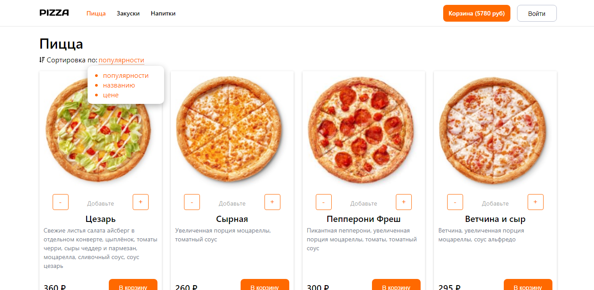
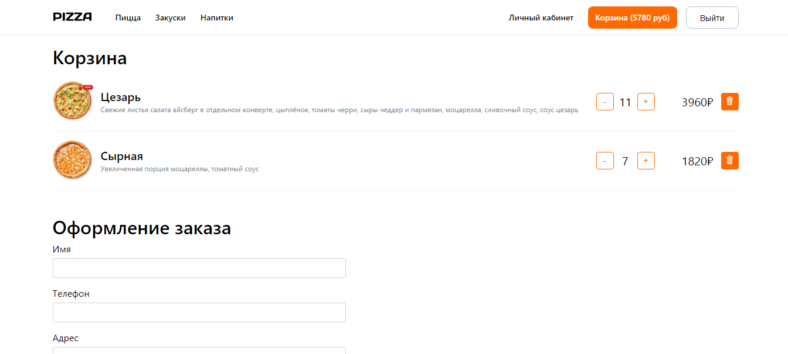
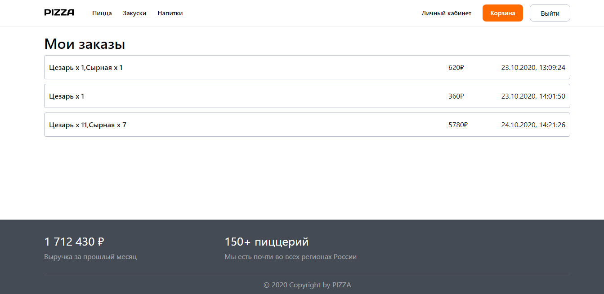

# MERN project + Typescript

Project shop using MERN stack + typescript.

This is the frontend repo built with React+typescript. Backend repo [click here](https://github.com/hardsmile98/pizza-server)

State manager: Redux
Router: React-router-dom

## Running Locally

Then run <code>npm i and npm run start</code>

## UI

### Main page

### Cart

### Cabinet

